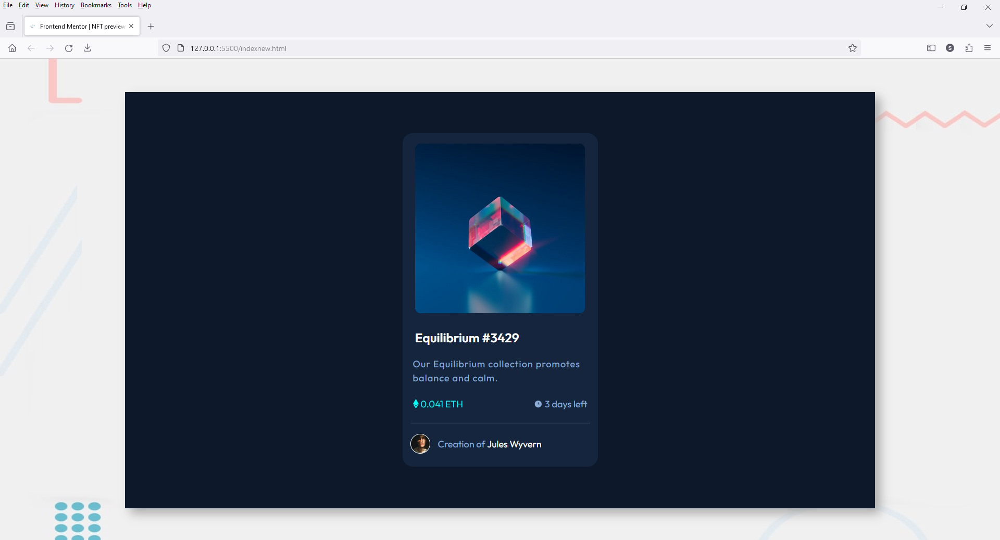

# Frontend Mentor - NFT preview card component solution

This is a solution to the [NFT preview card component challenge on Frontend Mentor](https://www.frontendmentor.io/challenges/nft-preview-card-component-SbdUL_w0U). Frontend Mentor challenges help you improve your coding skills by building realistic projects. 

## Table of contents

- [Overview](#overview)
  - [The challenge](#the-challenge)
  - [Screenshot](#screenshot)
  - [Links](#links)
- [My process](#my-process)
  - [Built with](#built-with)
  - [What I learned](#what-i-learned)
  - [Continued development](#continued-development)
- [Author](#author)
- [Acknowledgments](#acknowledgments)

## Overview

### The challenge

Users should be able to:

- View the optimal layout depending on their device's screen size
- See hover states for interactive elements

### Screenshot

### Links

- Solution URL: (http://www.madartistphoto.byethost5.com/nft-preview-card/nft-preview-card.html)

## My process

### Built with

- Visual Studio Code
- CSS custom properties
- Flexbox
- Mobile-first workflow
- ZonerX (for viewing the supplied images)
- Paint.net (for creating the hover effect of the main image)
- Filezilla (for transferring files to free website host)
- ByetHost (for hosting the files)
- GitHub (to become more familiar with it)

### What I learned

- I used 'onmouseover' and 'onmouseout' for the change in the primary image, as I couldn't get ':hover' to work properly.

- I had issues with changes I made to the .html file. When I uploaded it to the host and then would access it with my default browser (Firefox), Firefox would simply load the previously loaded page from its cache and not the new page from host, making it seem that none of my changer were working. It took a bit of hunting to find out how to change this behavior in Firefox.

- Do not throw out an old cell phone. It should still have wifi capabilities. I use my new phone and an old (smaller screen) phone to check my work once I upload it to my website host.

### Continued development

While I am doing mobile-first work, and now using an older, smaller phone, I have become more aware of using multiple media queries for different size screens. I will be working harder to make things look good on my small phone, larger phone, 11" ipad, and computer screen.

I am also trying to use the README.md files as a place not only for others to see my thoughts, but also as a type of journal to track my progress.

## Author

- Website - [MY Frontend Mentor Landing Page](https://www.madartistphoto.byethost5.com.com)
- Frontend Mentor - [John](https://www.frontendmentor.io/profile/MadArtistPhoto)

## Acknowledgments

Search the Internet to learn how to create websites for the Internet. Ain't technology wonderful.

